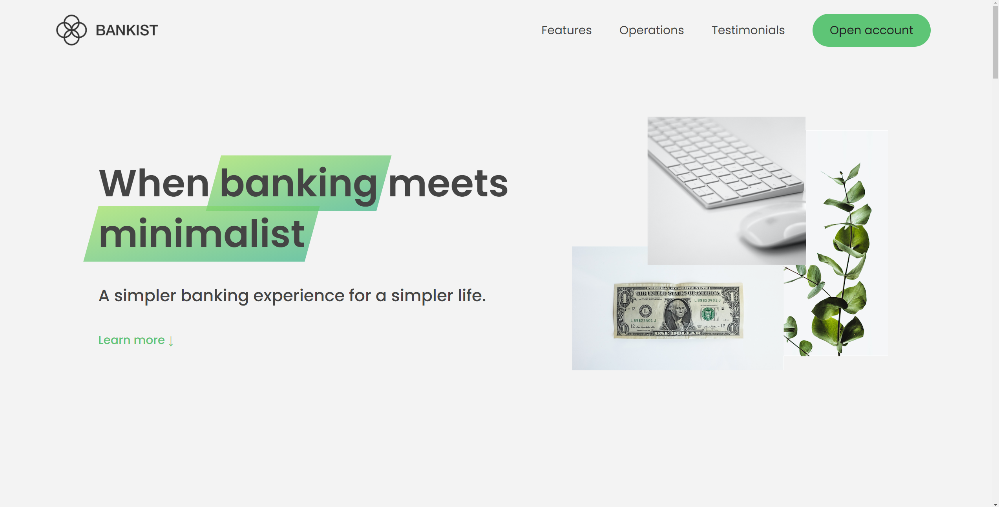

# Bankist

A project that primarily focuses on the usage of advanced DOM and the rendering of dynamic effects on web pages, it's implemented by **JavaScript**, **DOM** and **Intersection Observer** APIs. ***HTML5 and CSS3 templates are given by the Udemy instructor Jonas Schmedtmann***.

### Home Page

